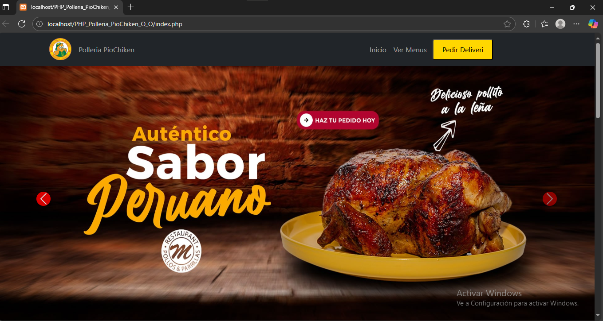
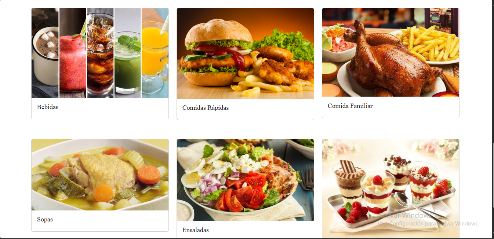
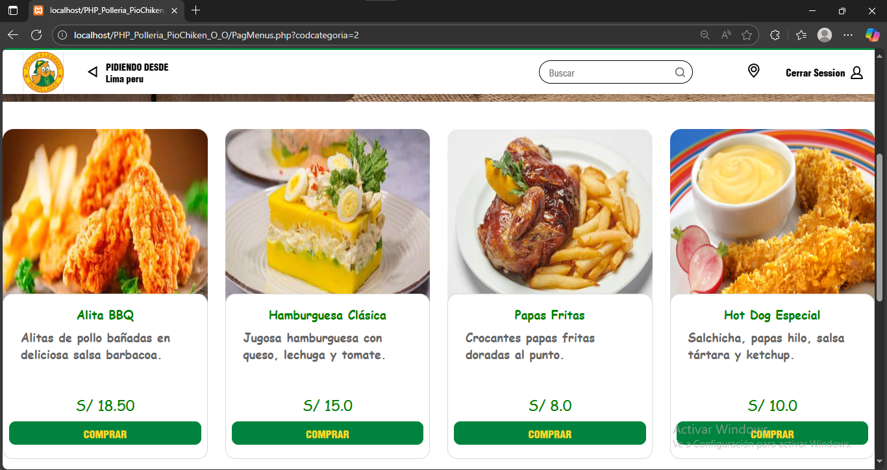
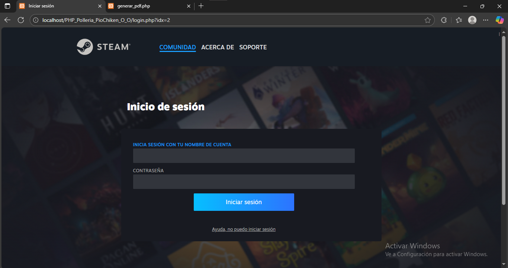
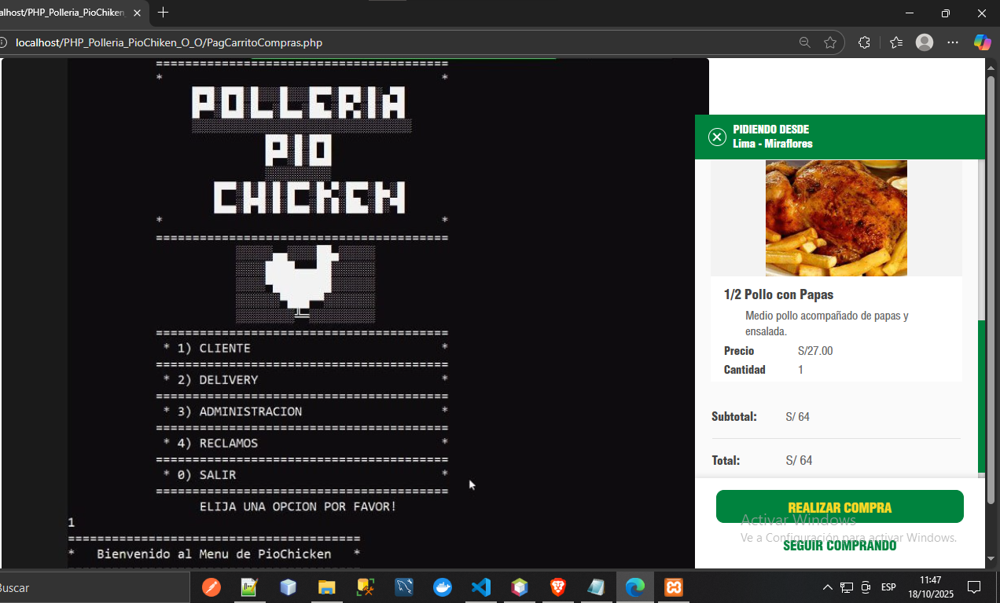
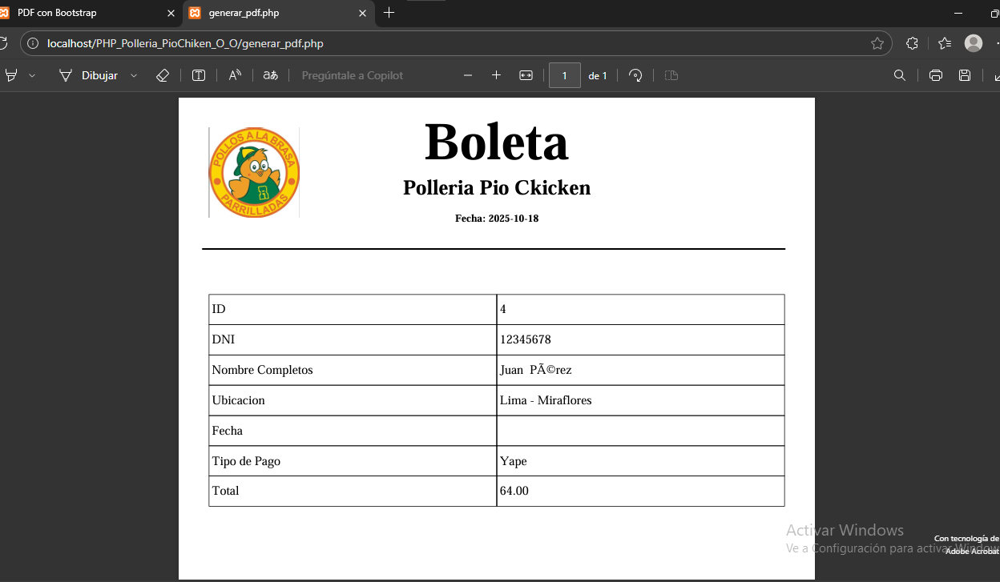

<div align="center">

# 🍗 **Sistema de Pollería — Proyecto Final**

### 🛒 Sistema Web con Carrito de Compras, Login y Control de Stock



---

### 💻 Desarrollado por **loko0055x**

🎓 Proyecto Final de Instituto | 🌐 Enfoque en E-commerce con PHP MVC

</div>

---

## 📝 **Descripción General**

El **Sistema de Pollería** es un proyecto web desarrollado como parte del **proyecto final del instituto**, inspirado en el funcionamiento real de una tienda virtual.

Su objetivo fue **ir más allá de un CRUD tradicional**, incorporando un **flujo completo de compras**, con registro de clientes, carrito, gestión automática de stock y generación de reportes.

💡 _Simula la experiencia de un e-commerce profesional para una pollería moderna._

---

## ⚙️ **Funcionalidades Principales**

| 🧩 Funcionalidad                   | Descripción                                                                    |
| ---------------------------------- | ------------------------------------------------------------------------------ |
| 👤 **Registro/Login de Clientes**  | Permite crear cuentas y acceder de forma segura.                               |
| 🍗 **Visualización de Categorías** | Muestra comidas agrupadas según su categoría (pollos, bebidas, postres, etc.). |
| 🛒 **Carrito de Compras Dinámico** | Agrega, elimina o modifica productos antes de comprar.                         |
| 📦 **Actualización de Stock**      | El stock se reduce automáticamente tras cada compra.                           |
| 📄 **Reporte de Compra**           | Muestra total, detalles del pedido y ubicación del cliente.                    |

---

## 🧰 **Tecnologías Utilizadas**

<div align="center">

| Tecnología                                                                                                                    | Uso                                  |
| ----------------------------------------------------------------------------------------------------------------------------- | ------------------------------------ |
|  **PHP (POO + PDO)**          | Lógica principal del sistema         |
|  **MySQL**                | Base de datos relacional             |
|  **Bootstrap 5**  | Diseño responsive y moderno          |
|  **HTML5**                | Estructura de las vistas             |
|  **CSS3**                   | Estilos personalizados               |
|  **JavaScript** | Funcionalidad interactiva            |
| 🧩 **MVC Pattern**                                                                                                            | Separación de lógica, modelo y vista |

</div>

## 🧱 **Arquitectura del Proyecto**

<div align="center">

bash
📦 Proyecto_Polleria/
│
├── 📁 assets/ # Archivos estáticos (imágenes, CSS, JS)
├── 📁 controllers/ # Controladores - lógica de flujo de datos
├── 📁 models/ # Modelos y conexión con la base de datos (PDO)
├── 📁 views/ # Vistas HTML + PHP (interfaz de usuario)
│
├── 📄 index.php # Punto de entrada principal del sistema
├── 📄 database.sql # Script SQL con la estructura de tablas
└── 📄 README.md # Documentación profesional del proyecto

</div> ```

## 🚀 **Flujo del Sistema**

<div align="center">

### 🏠 Página Principal

Visualización de todas las categorías de comidas disponibles.



---

### 🍗 Catálogo por Categorías

Los productos se muestran según la categoría seleccionada.



---

### 👤 Login / Registro

Acceso o creación de cuenta de cliente para realizar compras.



---

### 🛒 Carrito de Compras

Agrega productos, edita cantidades y elimina artículos fácilmente.



---

### 📊 Reporte de Compra

Resumen del pedido con detalle, precio total y ubicación del cliente.



</div>

---

## 🧠 **Proceso de Creación**

Este sistema inicialmente fue desarrollado en **Java Spring Boot**,  
pero posteriormente se migró a **PHP con arquitectura MVC** para lograr:

- Mayor control del flujo
- Simplicidad de conexión con MySQL
- Mejor desempeño visual usando **Bootstrap**

🧩 **IDE Utilizado:** NetBeans  
🧱 **Base de Datos:** MySQL Workbench

---

## 🧩 **Características Técnicas**

- ✅ Implementación de **POO + MVC + PDO**
- 🔐 Control de **sesiones seguras**
- 🗃️ Validación y gestión dinámica de stock
- 📜 Reporte detallado tras cada compra
- 🎨 Diseño adaptable y visual con **Bootstrap**

---

## 📸 **Galería Visual**

<div align="center">
 
 

</div>

---

## 👨‍💻 **Autor**

**Desarrollado por Glen David** | [Loko0055x](https://github.com/loko0055x)

---

## 🪪 **Licencia**

Este proyecto fue creado como proyecto final de insituto

---

<div align="center">

📘 **"La Mente no tiene Limites el tiempo si B>3"**

</div>
